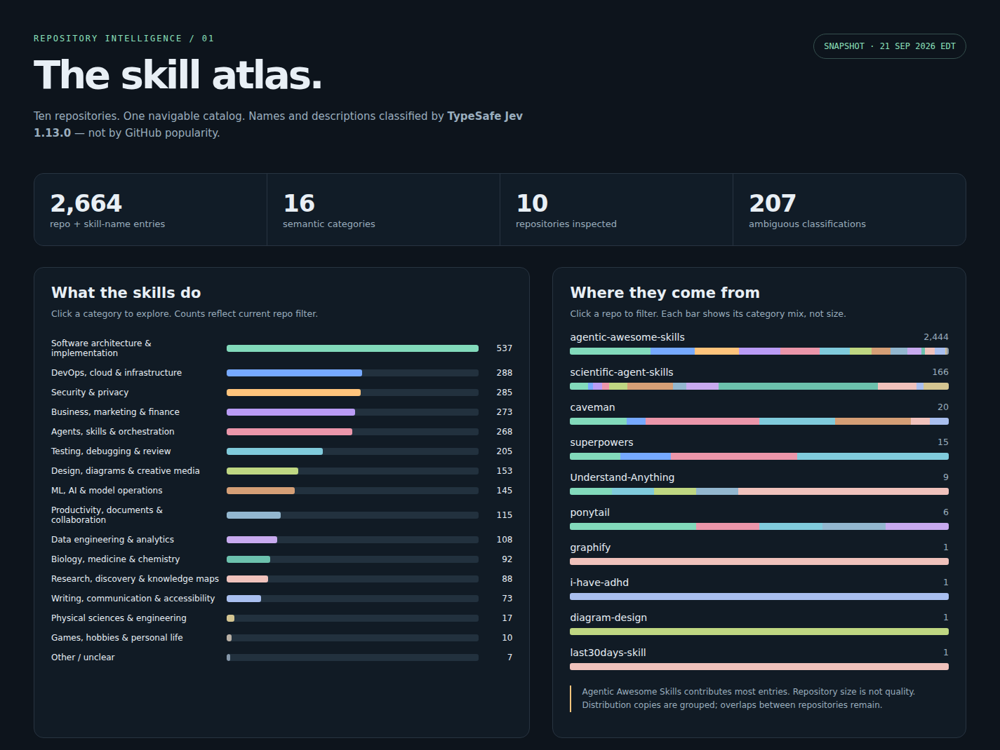

# Case study: from a Claude-skills atlas to finer task categories

This application began with a broad question: **what kinds of skills are in these repositories?** A prior catalog analysis grouped them into high-level categories and produced the original atlas below. The follow-up asked a different question: **which particular tasks do skills support, and where do those tasks overlap across repositories?** That motivated the finer-grained self-bootstrapping experiments.

This is a historical case study, not a claim that the classifier is accurate. A separate [portable setup guide](SETUP.md) reconstructs the exact original 20-record flat benchmark from pinned public sources and installs the unchanged project-authored gold now bundled here; source texts and historical runs are not redistributed. A trie scorer is not implemented. The broad catalog analysis predates the task-discovery tool; it was not the first stage of a hierarchical runtime pipeline.

## 1. High-level categories: the original skill atlas

*Original, unchanged aggregate visualization from the September 21, 2026 EDT catalog analysis. This is a static PNG: the pictured filter instructions are not interactive here. Repository bars show category proportions, not relative repository size. “Ambiguous classifications” means the editorial confidence flag described below, not measured error.*

The inventory found **7,863 `SKILL.md` file variants** across ten pinned repositories. Distribution copies were grouped by **repository + frontmatter name**, yielding **2,664 entries**; overlap across repositories was deliberately retained. Canonical records preferred `skills/` paths, then shorter paths. TypeSafe **Jev 1.13.0** assigned the canonical name and description to one of **16 fixed broad categories**. There were **2,659 distinct name/description pairs**, with identical pairs reusing one answer.

The largest groups were software architecture and implementation (**537**), DevOps/cloud/infrastructure (**288**), security/privacy (**285**), business/marketing/finance (**273**) and agents/skills/orchestration (**268**). These were descriptive catalog groupings, not discovered fine-grained task labels or quality rankings.

The **207** flags mark Choice confidence below **0.5**; they are separate from the **7** entries assigned “Other / unclear.” Neither number measures accuracy. Initial shared-list prompts had obvious errors; final classifications were rerun with each item directly embedded in its own structured question. No manual overrides were applied, and the final catalog still had no measured accuracy. No repository code was installed or executed; this was not a compatibility or security audit.

### Pinned source repositories

The snapshot was assembled at `2026-09-22T01:39:48.152226+00:00` (September 21 EDT). Links identify source revisions, not permission to redistribute their contents.

| Repository at snapshot | Entries |
|---|---:|
| [obra/superpowers](https://github.com/obra/superpowers/tree/5bf4e78011075bcfc0dc295f0724994cd123ee71) | 15 |
| [DietrichGebert/ponytail](https://github.com/DietrichGebert/ponytail/tree/e3ba2aa6f1e6f0bc4d69eb09c9f0d0a93af56156) | 6 |
| [Graphify-Labs/graphify](https://github.com/Graphify-Labs/graphify/tree/20a20d30d8e7eef77675651f0199d87f913bd3e7) | 1 |
| [JuliusBrussee/caveman](https://github.com/JuliusBrussee/caveman/tree/2fd153c67988e980fb0b2455c90832159a6a5a25) | 20 |
| [Egonex-AI/Understand-Anything](https://github.com/Egonex-AI/Understand-Anything/tree/6df3065f1d8ddc2ce3615314d1d493f36d6b1c80) | 9 |
| [mvanhorn/last30days-skill](https://github.com/mvanhorn/last30days-skill/tree/349ca444b4fda466e74d471dffa2aff36bb997f1) | 1 |
| [ayghri/i-have-adhd](https://github.com/ayghri/i-have-adhd/tree/839872f9d1cd634fed642b4589ce7226199cc15f) | 1 |
| [sickn33/agentic-awesome-skills](https://github.com/sickn33/agentic-awesome-skills/tree/c585de4848835abe9d753442621c58473fb8bb1e) | 2,444 |
| [K-Dense-AI/scientific-agent-skills](https://github.com/K-Dense-AI/scientific-agent-skills/tree/49c6e97775eaa18ba791bebe23162a70ae601c18) | 166 |
| [cathrynlavery/diagram-design](https://github.com/cathrynlavery/diagram-design/tree/dc1ace47b99a419e42d01a03cb6ace5346efa8ae) | 1 |

The PNG is preserved byte-for-byte (SHA-256 `b2e7cb641dad4a0f7a30df0216019f33c8c0b5a1871e372cf0f8f62da070e75d`). The interactive HTML embedded source descriptions and is **not** included, nor are catalog JSON, source excerpts or evidence archives.

## 2. Finer tasks: what would each skill help accomplish?

For this application, the goal was to group **concrete tasks and outcomes**, including equivalent tasks expressed differently across repositories or domains. A broad subject label helps browse a catalog but does not tell whether two skills accomplish the same thing. Categories therefore needed definitions with inclusions and exclusions, not just shared tools, writing styles or catchy names.

A skill may support several tasks while having one primary task for browsing. Insufficient evidence or no unique primary task should remain **Unclear**; a clear task outside the known definitions should be **Other** and invite investigation, not automatically count as a new category.

The later tool asks for domain Choice, primary-task Choice and independent membership Nouls. **It does not filter tasks by domain.** The broad atlas and the finer trials are successive research questions, not domain → task routing stages in the runtime. Their categories and uncertainty counts are not interchangeable.

### Three-run benchmark: the quality gate failed

The task benchmark used 20 sourced skills, mixing unique tasks with repeated task groups across repositories. A separate Jev normalizer mapped generated category definitions to reference labels; expected per-record answers were withheld from both categorization and normalization contexts. Same-model normalization was not independent human validation.

The gate required **at least 95% accuracy in each of three fresh runs and at least 95% valid all-three normalized agreement**.

| Historical condition | Accuracy by run | All-three agreement | Interpretation |
|---|---|---|---|
| Earlier trial | 95%, 95%, 95% | Not reported here | Review exposed citation-task scope conflation; numerical accuracy did not resolve the semantic problem |
| Later add-only roll-forward trial | 90%, 100%, 100% | 90% | **FAIL**: both the first-run accuracy and consistency requirements were missed |

Do not select the favorable runs and call the gate passed. Prompt or scoring-policy changes informed by these trials are benchmark-informed tuning, not held-out validation. These are historical observations, not experiments rerun for this publication.

## 3. Authorized full-corpus run: completion was not accuracy

After reviewing the failed gate, the user explicitly authorized a larger run. That authorization was a separate experimental decision, **not** a retroactive pass or automatic expansion by the CLI.

| Recorded outcome | Count |
|---|---:|
| Processed records | 2,664 |
| Final categories | 73 |
| Taxonomy versions | 59 |
| Known-category assignments | 2,141 |
| Unclear assignments | 521 |
| Other assignments | 2 |
| Provider calls | 2,783 |

Review identified **1,716 records misbucketed into “Command and capability reference.”** This exposed a broad category absorbing records rather than separating useful tasks. “Known-category assignment” means the model selected an existing label, **not** that the label was correct. Processing the full corpus and leaving only two Other assignments did not establish quality.

Add-only discovery preserves existing definitions and earlier assignments; it cannot repair a poor early category by later adding better ones. There is no historical replay or final consistency pass. The observed failure makes those tradeoffs concrete, without supplying a full-corpus accuracy estimate.

## What this case study establishes—and does not

- The earlier atlas provided a high-level view of a particular pinned catalog; it was not a validated task taxonomy.
- The finer trials exposed category-scope and consistency problems. Completion, low Other counts and confident judgments are not substitutes for quality evaluation.
- Nothing here demonstrates that installing these skills improves agent performance, that the method generalizes to other corpora, or that the full-corpus assignments are accurate.

This case study publishes explanatory prose, historical aggregate counts, pinned repository references and the original aggregate PNG. The [setup bundle](SETUP.md) additionally publishes the original project-authored task gold and a references/checksums-only download manifest. Corpus text, raw responses and historical run/config/source freezes remain excluded. The exact benchmark inputs are reconstructible, but these historical model results are **not a replayable experiment from this repository alone**. See [publication scope](../../docs/publication.md), the [runtime design](../../vision.md) and the [CLI quickstart](../../README.md#quickstart).
